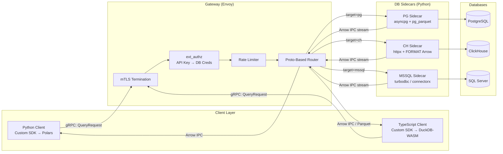
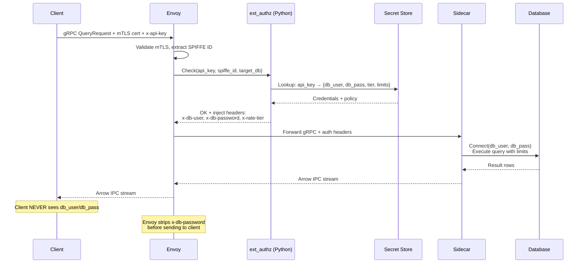

# Enterprise Multi-Protocol Database Gateway — V2: Sidecar Architecture

> **Iteration:** V2 — Custom Client Libraries + Per-DB Sidecars  
> **Date:** 2026-03-14  
> **Evolution from V1:** V1 used Envoy as a transparent L4/L7 proxy with pass-through routing. V2 introduces an **opaque gateway** where clients speak a custom protobuf interface, per-DB sidecars handle query execution and result serialization to Arrow/Parquet, and clients receive normalized columnar data.

---

## 1. Architectural Overview

### 1.1 The Shift: From Transparent Proxy to Intelligent Gateway

In V1, Envoy was a routing/auth layer and clients spoke native DB protocols. In V2:

- **Clients never speak raw DB protocols.** They send a `QueryRequest` protobuf to the gateway.
- **The gateway** (Envoy) handles mTLS, `ext_authz`, rate limiting, then routes to the correct **DB sidecar**.
- **Per-DB sidecars** (Python services) execute the actual query, enforce granular limits, and serialize results to **Arrow IPC** or **Parquet** before streaming back.
- **Python clients** receive Arrow IPC and load it **zero-copy into Polars** DataFrames.
- **TypeScript clients** receive Arrow IPC (or Parquet) and load it into **DuckDB-WASM**, enabling full local SQL querying in the browser.



### 1.2 Key Design Principles

| Principle | Implementation |
|---|---|
| **Clients are format-agnostic to DBs** | Custom proto abstracts all three databases behind a single `QueryRequest` / `QueryResponse` |
| **Serialization happens at the sidecar** | DBs return native formats; sidecars normalize to Arrow IPC |
| **Zero-copy delivery for Python** | Arrow IPC → `polars.from_arrow()` — no intermediate pandas/dict conversion |
| **Local-first analytics for TypeScript** | Arrow IPC → DuckDB-WASM → full SQL in the browser |
| **Sidecars own query governance** | Statement timeouts, row limits, read-only enforcement — all at the sidecar, not the proxy |
| **Proxy owns connection governance** | mTLS, API-key auth, rate limiting, circuit breaking — proxy layer |

---

## 2. The Custom Proto Contract

### 2.1 Service Definition

```protobuf
syntax = "proto3";
package gateway.v1;

service DataGateway {
  // Unary: for small result sets
  rpc Query(QueryRequest) returns (QueryResponse);

  // Server-streaming: for large result sets
  rpc QueryStream(QueryRequest) returns (stream QueryChunk);

  // Metadata: schema inspection
  rpc GetSchema(SchemaRequest) returns (SchemaResponse);
}

message QueryRequest {
  string target = 1;         // "pg", "clickhouse", "mssql"
  string database = 2;       // target database name
  string sql = 3;            // SQL query text
  map<string, string> params = 4;  // parameterized query bindings
  OutputFormat format = 5;   // requested output format
  QueryLimits limits = 6;    // client-requested limits (sidecar enforces ceiling)
}

enum OutputFormat {
  ARROW_IPC = 0;   // Default: Arrow IPC streaming format
  PARQUET = 1;     // Parquet (compressed, for storage/download)
  JSON = 2;        // JSON (for UI rendering — see §8 for cost analysis)
}

message QueryLimits {
  int64 max_rows = 1;        // max rows to return (0 = sidecar default)
  int64 max_bytes = 2;       // max response size in bytes
  int32 timeout_seconds = 3; // query execution timeout
}

message QueryResponse {
  bytes data = 1;                // serialized Arrow IPC / Parquet / JSON
  ResponseMetadata metadata = 2;
}

message QueryChunk {
  bytes data = 1;                // one Arrow RecordBatch (IPC) or Parquet row group
  bool is_last = 2;             // true on final chunk
  ResponseMetadata metadata = 3; // populated only on last chunk
}

message ResponseMetadata {
  int64 rows_returned = 1;
  int64 bytes_scanned = 2;
  int64 execution_time_ms = 3;
  string query_id = 4;          // trace ID for correlation
  Schema schema = 5;            // Arrow schema of the result
}
```

### 2.2 Routing at the Proxy

Envoy routes gRPC requests based on the `target` field from the proto. This can be done via:

1. **Header-based routing:** The client library sets an `x-target-db` metadata header → Envoy routes to the matching sidecar cluster
2. **gRPC method routing:** All methods route to a single gateway service, which internally dispatches

**Option 1 is recommended** — it keeps Envoy's config simple and avoids a fan-out service:

```yaml
routes:
  - match:
      prefix: "/gateway.v1.DataGateway/"
      headers:
        - name: "x-target-db"
          string_match: { exact: "pg" }
    route: { cluster: sidecar_pg }
  - match:
      prefix: "/gateway.v1.DataGateway/"
      headers:
        - name: "x-target-db"
          string_match: { exact: "clickhouse" }
    route: { cluster: sidecar_ch }
  - match:
      prefix: "/gateway.v1.DataGateway/"
      headers:
        - name: "x-target-db"
          string_match: { exact: "mssql" }
    route: { cluster: sidecar_mssql }
```

---

## 3. Per-DB Sidecar Architecture

Each sidecar is a Python gRPC service that:

1. Receives `QueryRequest` from Envoy (with injected auth headers from `ext_authz`)
2. Extracts the mapped DB credentials from the `ext_authz`-injected headers
3. Connects to the target database using credentials the client never sees
4. Enforces query limits (timeouts, row caps, read-only)
5. Executes the query
6. Serializes results to the requested format (Arrow IPC, Parquet, or JSON)
7. Streams results back through Envoy to the client

### 3.1 Sidecar Internals — Common Pattern

```python
class BaseSidecar(DataGatewayServicer):
    """Common sidecar logic shared across all DB backends."""

    async def QueryStream(
        self,
        request: QueryRequest,
        context: grpc.aio.ServicerContext,
    ) -> AsyncIterator[QueryChunk]:
        # 1. Extract credentials injected by ext_authz
        db_user = dict(context.invocation_metadata()).get("x-db-user")
        db_pass = dict(context.invocation_metadata()).get("x-db-password")

        # 2. Enforce limits ceiling (sidecar config overrides client request)
        limits = self._enforce_ceiling(request.limits)

        # 3. Execute query via DB-specific driver
        trace_id = str(uuid4())
        async for arrow_batch in self._execute_query(
            request.sql, request.params, db_user, db_pass,
            request.database, limits, trace_id
        ):
            # 4. Serialize to requested format
            chunk_data = self._serialize(arrow_batch, request.format)
            yield QueryChunk(data=chunk_data, is_last=False)

        # 5. Final chunk with metadata
        yield QueryChunk(
            data=b"", is_last=True,
            metadata=self._build_metadata(trace_id)
        )
```

### 3.2 PostgreSQL Sidecar

**Driver:** `asyncpg` (high-performance asyncio PostgreSQL driver)

**Arrow serialization strategy:** Two paths available:

| Path | Mechanism | Best For |
|---|---|---|
| **A: Server-side `pg_parquet`** | `COPY (SELECT ...) TO STDOUT WITH (FORMAT 'parquet')` | Large analytical results; leverages Postgres CPU for columnar conversion |
| **B: Sidecar-side conversion** | `asyncpg` → Python tuples → `pyarrow.RecordBatch` | Flexibility; works without extensions; allows streaming row batches |

**Recommendation:** **Path B** for general use (no server extension dependency), **Path A** for bulk exports where the Postgres server has spare CPU.

```python
class PgSidecar(BaseSidecar):
    async def _execute_query(
        self, sql: str, params: dict, user: str, password: str,
        database: str, limits: QueryLimits, trace_id: str,
    ) -> AsyncIterator[pa.RecordBatch]:
        conn = await asyncpg.connect(
            host=PG_HOST, database=database,
            user=user, password=password,
            server_settings={
                "statement_timeout": str(limits.timeout_seconds * 1000),
                "default_transaction_read_only": "on",
            },
        )
        try:
            # Inject trace ID as SQL comment for correlation
            traced_sql = f"/* trace_id={trace_id} */ {sql}"

            # Stream rows in batches of 10,000
            batch_size = 10_000
            rows_sent = 0
            async with conn.transaction():
                cursor = await conn.cursor(traced_sql)
                while True:
                    rows = await cursor.fetch(batch_size)
                    if not rows:
                        break
                    # Convert to Arrow RecordBatch
                    batch = self._rows_to_arrow(rows, cursor)
                    rows_sent += len(rows)
                    if limits.max_rows and rows_sent >= limits.max_rows:
                        yield batch
                        break
                    yield batch
        finally:
            await conn.close()
```

### 3.3 ClickHouse Sidecar

**Driver:** `httpx` (async HTTP client) — ClickHouse HTTP interface

**Arrow serialization strategy:** ClickHouse natively supports `FORMAT Arrow` and `FORMAT Parquet` in query responses. The sidecar **does not need to serialize** — it passes the native Arrow/Parquet binary stream directly.

```python
class ClickHouseSidecar(BaseSidecar):
    async def _execute_query(
        self, sql: str, params: dict, user: str, password: str,
        database: str, limits: QueryLimits, trace_id: str,
    ) -> AsyncIterator[pa.RecordBatch]:
        # ClickHouse handles Arrow natively — minimal sidecar CPU
        format_clause = "FORMAT ArrowStream"  # Streaming Arrow IPC
        constrained_sql = f"""
            /* trace_id={trace_id} */
            {sql}
            {format_clause}
        """
        async with httpx.AsyncClient() as client:
            async with client.stream(
                "POST",
                f"{CH_HTTP_URL}/?database={database}",
                content=constrained_sql,
                headers={
                    "X-ClickHouse-User": user,
                    "X-ClickHouse-Key": password,
                    "X-ClickHouse-Setting-readonly": "1",
                    "X-ClickHouse-Setting-max_result_rows": str(limits.max_rows or 100_000),
                    "X-ClickHouse-Setting-max_execution_time": str(limits.timeout_seconds or 60),
                    "X-ClickHouse-Setting-max_bytes_to_read": str(limits.max_bytes or 50 * 1024**3),
                    "X-ClickHouse-Setting-log_comment": trace_id,
                },
            ) as response:
                response.raise_for_status()
                # Stream raw Arrow IPC bytes — already in Arrow format
                reader = pa.ipc.open_stream(response.aiter_bytes())
                for batch in reader:
                    yield batch
```

> [!TIP]
> **ClickHouse is the most efficient sidecar** because the database itself performs Arrow serialization. The sidecar's CPU cost is near-zero — it's essentially a pass-through with credential injection and limit enforcement. This is a major architectural advantage of ClickHouse's `FORMAT Arrow` / `FORMAT ArrowStream` support.

### 3.4 SQL Server Sidecar — Deep Dive

SQL Server is the most challenging backend because:

1. **No native Arrow/Parquet output format** — TDS returns row-oriented data
2. **The sidecar must perform all serialization** — row-to-columnar conversion happens in Python
3. **SQLAlchemy ORM overhead is unacceptable** for high-throughput analytical queries

#### 3.4.1 Driver Options — Benchmark Analysis

| Driver | Architecture | Arrow Support | Overhead | Throughput | Verdict |
|---|---|---|---|---|---|
| **SQLAlchemy ORM** | Python ORM → pyodbc → ODBC | ❌ None | 🔴 Very High — ORM object creation, session management, lazy loading, type coercion | ~500 rows/ms | ❌ **Reject** — ORM layer adds 3–5× CPU overhead vs raw driver |
| **SQLAlchemy Core** | SQL expression → pyodbc → ODBC | ❌ None | 🟡 Medium — no ORM objects, but still abstraction overhead | ~1,200 rows/ms | ⚠️ Acceptable only if you need SA's connection pooling |
| **pyodbc** | Direct ODBC binding | ❌ None (row-oriented) | 🟢 Low — direct cursor.fetchmany() | ~2,000 rows/ms | ⚠️ Viable baseline; requires manual Arrow conversion |
| **turbodbc** | ODBC with columnar API | ✅ **Native `fetchallarrow()`** | 🟢 Very Low — columnar ODBC buffers → Arrow directly | ~8,000 rows/ms | ✅ **Recommended** — 4× faster than pyodbc, native Arrow |
| **connectorx** | Rust engine, DB wire protocol | ✅ **Direct to Arrow/Polars** | 🟢 Minimal — Rust, zero-copy | ~12,000 rows/ms | ✅ **Best throughput** — 6× pyodbc; Rust handles serialization |
| **mssql-python** | MS DDBC C++ layer | ❌ None (new driver, row-oriented) | 🟢 Low — 2–4× faster than pyodbc for raw ops | ~4,000 rows/ms | ⚠️ New (2025), fast, but no Arrow integration yet |

> [!IMPORTANT]
> **Throughput numbers are approximate** and depend on row width, network, and SQL Server configuration. They represent relative performance for a ~20-column, mixed-type analytical result set.

#### 3.4.2 Recommended Strategy: Tiered Approach

```
┌──────────────────────────────────────────────────┐
│              SQL Server Sidecar                   │
│                                                   │
│  Tier 1 (Default): connectorx                     │
│  ┌───────────────────────────────────────────┐   │
│  │  Rust engine → ODBC → Arrow Tables        │   │
│  │  Zero-copy, auto-parallelizes partitions  │   │
│  │  Best for: bulk analytical SELECT         │   │
│  └───────────────────────────────────────────┘   │
│                                                   │
│  Tier 2 (Streaming): turbodbc                     │
│  ┌───────────────────────────────────────────┐   │
│  │  ODBC columnar API → fetchallarrow()      │   │
│  │  Streaming row-group-at-a-time             │   │
│  │  Best for: large results that need         │   │
│  │  streaming (>1GB), parameterized queries   │   │
│  └───────────────────────────────────────────┘   │
│                                                   │
│  Tier 3 (Fallback): pyodbc + manual Arrow         │
│  ┌───────────────────────────────────────────┐   │
│  │  cursor.fetchmany() → pyarrow.array()     │   │
│  │  For edge cases connectorx/turbodbc       │   │
│  │  don't support (e.g., NTEXT, XML columns) │   │
│  └───────────────────────────────────────────┘   │
└──────────────────────────────────────────────────┘
```

#### 3.4.3 SQL Server Sidecar Implementation

```python
import connectorx as cx
import turbodbc
import pyarrow as pa

class MSSQLSidecar(BaseSidecar):
    async def _execute_query(
        self, sql: str, params: dict, user: str, password: str,
        database: str, limits: QueryLimits, trace_id: str,
    ) -> AsyncIterator[pa.RecordBatch]:
        conn_str = (
            f"mssql://{user}:{password}@{MSSQL_HOST}:{MSSQL_PORT}"
            f"/{database}?ApplicationIntent=ReadOnly&TrustServerCertificate=yes"
        )
        traced_sql = f"/* trace_id={trace_id} */ {sql}"

        # --- Tier 1: connectorx (synchronous, run in thread pool) ---
        try:
            arrow_table: pa.Table = await asyncio.to_thread(
                cx.read_sql,
                conn_str,
                traced_sql,
                return_type="arrow2",
                partition_on=None,  # single-partition for read-only queries
            )
            # Stream as RecordBatches
            for batch in arrow_table.to_batches(max_chunksize=50_000):
                yield batch
            return
        except Exception:
            pass  # Fall through to Tier 2

        # --- Tier 2: turbodbc streaming ---
        try:
            odbc_conn_str = (
                f"DRIVER={{ODBC Driver 18 for SQL Server}};"
                f"SERVER={MSSQL_HOST},{MSSQL_PORT};"
                f"DATABASE={database};UID={user};PWD={password};"
                f"ApplicationIntent=ReadOnly"
            )
            connection = await asyncio.to_thread(
                turbodbc.connect, connection_string=odbc_conn_str
            )
            cursor = connection.cursor()
            await asyncio.to_thread(cursor.execute, traced_sql)

            # turbodbc natively returns Arrow batches
            batches = await asyncio.to_thread(cursor.fetcharrowbatches)
            for batch in batches:
                yield batch
            cursor.close()
            connection.close()
            return
        except Exception:
            pass  # Fall through to Tier 3

        # --- Tier 3: pyodbc fallback ---
        # ... manual fetchmany() + pyarrow.array() conversion
```

#### 3.4.4 CPU/Memory Impact Analysis: SQL Server Path

| Step | CPU Impact | Memory Impact | Notes |
|---|---|---|---|
| TDS wire receive | Low | O(batch_size) | Stream rows from SQL Server |
| **connectorx: TDS → Arrow** | **Low** (Rust) | **O(result_set)** | Entire result materialized in Arrow format. For >4GB results, must use turbodbc streaming |
| **turbodbc: ODBC → Arrow** | **Medium** (C++ columnar API) | **O(batch_size)** | Streams in batches. Each batch is ~50K rows. Memory capped at batch size |
| **pyodbc: rows → Arrow** | **High** (Python loops) | **O(batch_size)** | Python-level type conversion. ~3–5× CPU of turbodbc |
| SQLAlchemy ORM | **Very High** | **O(result_set)** | Object creation, identity map, relationship loading. 10× CPU vs connectorx |
| Arrow → Parquet compression | Medium (Snappy/ZSTD) | O(batch_size) | ~2–5× compression ratio. CPU cost depends on codec |

> [!CAUTION]
> **connectorx materializes the entire result set into memory** before returning. For results >2GB, use **turbodbc with `fetcharrowbatches()`** which streams in chunks. Set the sidecar pod memory limit accordingly: `max_concurrent_queries × avg_result_size_mb × 2` (for peak + overhead).

---

## 4. Client Library Design

### 4.1 Python Client — Polars Integration

The Python client library wraps the gRPC stub and delivers results directly into Polars DataFrames via zero-copy Arrow:

```python
import grpc
import polars as pl
import pyarrow as pa
import pyarrow.ipc

class GatewayClient:
    """Custom Python client for the Data Gateway."""

    def __init__(self, gateway_url: str, api_key: str, cert_path: str):
        credentials = grpc.ssl_channel_credentials(
            root_certificates=open(f"{cert_path}/ca.pem", "rb").read(),
            private_key=open(f"{cert_path}/client.key", "rb").read(),
            certificate_chain=open(f"{cert_path}/client.crt", "rb").read(),
        )
        self._channel = grpc.aio.secure_channel(gateway_url, credentials)
        self._stub = DataGatewayStub(self._channel)
        self._api_key = api_key

    async def query(
        self, target: str, sql: str, database: str = "default",
        max_rows: int = 0, timeout: int = 60,
    ) -> pl.DataFrame:
        """Execute a query and return results as a Polars DataFrame."""
        request = QueryRequest(
            target=target, database=database, sql=sql,
            format=OutputFormat.ARROW_IPC,
            limits=QueryLimits(max_rows=max_rows, timeout_seconds=timeout),
        )
        metadata = [
            ("x-api-key", self._api_key),
            ("x-target-db", target),
        ]

        # Streaming: collect Arrow batches
        batches: list[pa.RecordBatch] = []
        async for chunk in self._stub.QueryStream(request, metadata=metadata):
            if chunk.data:
                reader = pa.ipc.open_stream(chunk.data)
                for batch in reader:
                    batches.append(batch)

        # Zero-copy: Arrow Table → Polars DataFrame
        arrow_table = pa.Table.from_batches(batches)
        return pl.from_arrow(arrow_table)  # Zero-copy when dtypes align
```

**Performance characteristics:**
- `polars.from_arrow()` is **zero-copy** for standard types (int, float, string, bool, timestamp)
- Polars' Rust engine operates directly on Arrow memory buffers — no Python object creation
- For a 100M row × 20 column result: ~2 seconds network + ~50ms Arrow→Polars conversion

### 4.2 TypeScript Client — DuckDB-WASM Integration

The TypeScript client receives Arrow IPC data and loads it into DuckDB-WASM for local querying:

```typescript
import * as duckdb from "@duckdb/duckdb-wasm";
import { tableFromIPC } from "apache-arrow";

class GatewayClient {
  private db: duckdb.AsyncDuckDB;
  private conn: duckdb.AsyncDuckDBConnection;

  async query(target: string, sql: string, database: string = "default"): Promise<void> {
    const response = await this.grpcClient.queryStream({
      target,
      database,
      sql,
      format: OutputFormat.ARROW_IPC,
      limits: { maxRows: 100_000, timeoutSeconds: 60 },
    });

    // Collect Arrow IPC chunks
    const chunks: Uint8Array[] = [];
    for await (const chunk of response) {
      if (chunk.data.length > 0) {
        chunks.push(chunk.data);
      }
    }

    // Load into DuckDB-WASM
    const arrowData = concatUint8Arrays(chunks);
    const tableName = `result_${Date.now()}`;

    // Register Arrow IPC buffer directly — DuckDB reads it natively
    await this.db.registerFileBuffer(`${tableName}.arrow`, arrowData);
    await this.conn.query(`
      CREATE TABLE ${tableName} AS
      SELECT * FROM read_ipc('${tableName}.arrow')
    `);
  }

  // UI can now query the local DuckDB table
  async localQuery(sql: string): Promise<arrow.Table> {
    return await this.conn.query(sql);
  }
}
```

**DuckDB-WASM capabilities and limits:**

| Capability | Value |
|---|---|
| Engine | Vectorized columnar, WASM-compiled |
| Performance | Sub-second on millions of rows in-browser |
| Arrow IPC ingest | Native — `read_ipc()` function, zero-deserialization |
| Parquet ingest | Native — `read_parquet()` with column pruning and predicate pushdown |
| Memory limit | Browser-dependent; ~1–2 GB practical limit on most devices |
| Threading | Currently single-threaded in WASM (Web Workers for isolation) |
| Best for | Interactive dashboards, ad-hoc filtering/aggregation of pre-fetched result sets |

### 4.3 Format Decision Matrix for Clients

| Scenario | Format | Rationale |
|---|---|---|
| **Python analytics** | Arrow IPC (streaming) | Zero-copy to Polars; lowest latency; best memory efficiency |
| **TypeScript dashboard** | Arrow IPC | DuckDB-WASM ingests natively; 10–100× faster than JSON parsing |
| **TypeScript download/export** | Parquet | 2–5× compression; user can download .parquet file for offline analysis |
| **Simple UI rendering** (limited rows) | JSON | See §8 for cost analysis. Only viable for <10K rows |
| **Bulk ETL / data pipeline** | Parquet (ZSTD) | Best compression; schema embedded; cross-platform |

---

## 5. Serialization Cost Analysis

### 5.1 Sidecar CPU Cost by Database × Format

| Database | To Arrow IPC | To Parquet | To JSON |
|---|---|---|---|
| **ClickHouse** | 🟢 **Near-zero** — `FORMAT ArrowStream` is server-side | 🟢 **Near-zero** — `FORMAT Parquet` is server-side | 🟡 Medium — sidecar must deserialize Arrow then serialize JSON |
| **PostgreSQL** | 🟡 Medium — sidecar converts asyncpg rows → Arrow batches | 🟡 Medium-High — Arrow → Parquet adds compression pass | 🔴 High — rows → dicts → JSON; Python serialization bottleneck |
| **SQL Server** | 🟡 Medium (turbodbc) / 🟢 Low (connectorx) | 🟡 Medium-High — Arrow → Parquet compression | 🔴 Very High — row-by-row Python conversion + JSON serialization |

### 5.2 Memory Consumption by Format (100M rows × 20 cols, mixed types)

| Metric | Arrow IPC | Parquet (ZSTD) | JSON |
|---|---|---|---|
| **Wire size** | ~1.8 GB | ~400 MB | ~4.5 GB |
| **Sidecar peak memory** | ~200 MB (streamed) | ~200 MB (streamed) + compression buffer | ~4.5 GB (must materialize JSON) |
| **Client ingest time** | ~2s (Python) / ~3s (browser) | ~4s (decompress) | ~15s (parse) |
| **Client memory** | ~1.8 GB (zero-copy) | ~1.8 GB (after decompress) | ~6 GB (JS object overhead) |

### 5.3 Sidecar Sizing Recommendations

| Workload | Sidecar pods | CPU | Memory | Notes |
|---|---|---|---|---|
| ClickHouse (Arrow passthrough) | 3 | 0.5 vCPU | 512 MB | Near-zero conversion work |
| PostgreSQL (asyncpg → Arrow) | 3 | 2 vCPU | 2 GB | CPU for row→columnar conversion |
| SQL Server (connectorx) | 3 | 4 vCPU | 4 GB | Rust serialization + larger result materialization |
| SQL Server (turbodbc streaming) | 3 | 2 vCPU | 2 GB | Lower memory due to batched streaming |

---

## 6. Connection Governance at the Sidecar

The sidecar enforces limits that V1 attempted at the proxy level but couldn't achieve due to protocol opacity:

### 6.1 Enforcement Matrix

| Guardrail | PostgreSQL Sidecar | ClickHouse Sidecar | SQL Server Sidecar |
|---|---|---|---|
| **Read-only** | `SET default_transaction_read_only=on` in connection | `readonly=1` HTTP header | `ApplicationIntent=ReadOnly` in connection string + `db_datareader` role |
| **Statement timeout** | `SET statement_timeout=60000` | `max_execution_time=60` header | `SET LOCK_TIMEOUT 60000` + Resource Governor |
| **Max rows** | Sidecar logic: count + break | `max_result_rows=10000` header | Sidecar logic: count + `cursor.close()` early |
| **Max bytes scanned** | N/A (use `statement_timeout` as proxy) | `max_bytes_to_read=50GB` header | Resource Governor `REQUEST_MAX_MEMORY_GRANT_PERCENT` |
| **Trace ID injection** | SQL comment: `/* trace_id=... */` | `log_comment` setting via header | SQL comment: `/* trace_id=... */` |
| **Query kill on disconnect** | `pg_terminate_backend(pid)` | `KILL QUERY WHERE query LIKE '%trace_id=%'` | `KILL <spid>` |

### 6.2 Sidecar Connection Pooling

Each sidecar maintains its own connection pool to the database. The sidecar owns the pool, not Envoy:

| Database | Pool Implementation | Configuration |
|---|---|---|
| PostgreSQL | `asyncpg.Pool` (10–50 connections) | Transaction-mode. Sidecar acquires connection, executes query, returns to pool. No PgBouncer needed — the sidecar IS the pooler |
| ClickHouse | `httpx.AsyncClient` with connection limits | HTTP/2 multiplexing. Persistent connections with keepalive. ClickHouse HTTP supports concurrent queries on single connection |
| SQL Server | `turbodbc.connect()` pool or `connectorx` built-in | connectorx manages its own thread pool internally. turbodbc connections pooled manually or via `sqlalchemy-turbodbc` with SA Core |

> [!IMPORTANT]
> **The sidecar architecture eliminates the need for PgBouncer.** In V1, PgBouncer sat between Envoy and PostgreSQL because Envoy couldn't do transaction-mode pooling. In V2, the sidecar opens connections with specific credentials, executes the query, and returns the connection to its pool. The sidecar IS the connection pooler.

---

## 7. Auth Flow — API Key to DB Credential Mapping



**Header stripping:** Envoy removes sensitive headers from the response to the client:

```yaml
response_headers_to_remove:
  - "x-db-user"
  - "x-db-password"
  - "x-db-connection-string"
```

---

## 8. JSON Fallback — Cost Analysis for UI Consumers

Some UI components need rendered JSON (e.g., a table grid, a chart). This section analyzes the cost of JSON as an output format.

### 8.1 JSON Serialization Cost at the Sidecar

| Result Size | Arrow→JSON CPU Time | Memory Overhead | Network Size |
|---|---|---|---|
| 1K rows × 10 cols | ~2 ms | ~50 KB | ~80 KB |
| 10K rows × 10 cols | ~20 ms | ~500 KB | ~800 KB |
| 100K rows × 20 cols | ~500 ms | ~50 MB | ~80 MB |
| 1M rows × 20 cols | ~5 sec | ~500 MB | ~800 MB |

### 8.2 Recommended Approach: Hybrid

```
┌─────────────────────────────────────────────────────┐
│              TypeScript Client                       │
│                                                      │
│  1. Fetch full result → Arrow IPC → DuckDB-WASM     │
│  2. UI component needs visible rows:                 │
│     SELECT * FROM result WHERE ... LIMIT 100         │
│  3. DuckDB returns JSON for the visible page only    │
│  4. UI renders JSON from local DuckDB                │
└─────────────────────────────────────────────────────┘
```

**This means the sidecar NEVER produces JSON.** JSON is produced locally by DuckDB-WASM for the visible page/component only. Benefits:

- Sidecar CPU stays minimal
- Network transfers only Arrow/Parquet (compact)
- UI has full ad-hoc query capability locally
- Pagination, filtering, sorting — all local, zero round-trips

> [!TIP]
> **The only scenario where the sidecar should produce JSON** is for clients that cannot run DuckDB-WASM (e.g., server-side rendered pages, mobile apps, third-party integrations). In that case, enforce a hard `max_rows=10000` limit in the proto `QueryLimits` when `format=JSON` to prevent memory blowout.

---

## 9. SQL Server — Extended Analysis

### 9.1 Why SQLAlchemy Is Problematic

SQLAlchemy has two layers, each with distinct overhead:

1. **Core** (~1.5× overhead vs raw ODBC): SQL expression compilation, type adaptation, connection pool management, result proxy objects
2. **ORM** (~5–10× overhead vs raw ODBC): Identity map, unit of work pattern, relationship lazy loading, change tracking, Python object instantiation per row

For a gateway sidecar, **neither layer is needed**:
- We don't construct SQL — the client sends raw SQL
- We don't map objects — we map rows to Arrow columns
- We don't track changes — we're read-only
- Connection pooling is simpler at the sidecar level

### 9.2 connectorx vs turbodbc — When to Use Which

| Dimension | connectorx | turbodbc |
|---|---|---|
| **Language** | Rust core with Python binding | C++ core (ODBC API) with Python binding |
| **Parallelism** | Auto-partitions queries across threads | Single-threaded per query |
| **Streaming** | ❌ Materializes full result before returning | ✅ `fetcharrowbatches()` streams batches |
| **Memory** | O(full result) | O(batch size) |
| **Parameterized queries** | ⚠️ Limited support | ✅ Full ODBC parameterization |
| **Arrow output** | ✅ Native Arrow2 tables | ✅ Native Arrow batches |
| **SQL Server support** | ✅ Via ODBC driver | ✅ Via ODBC driver |
| **Maturity** | Newer, less battle-tested in prod | Mature, widely used |
| **Best for** | Bulk `SELECT` with known-bounded results (<2 GB) | Streaming large results, parameterized queries |

### 9.3 Escape Hatch: FreeTDS + Pre-Login TDS Manipulation

For advanced scenarios where `ApplicationIntent=ReadOnly` must be injected at the TDS protocol level (e.g., the SQL Server doesn't support `ApplicationIntent` on older versions), a FreeTDS-based approach via `pymssql` or a custom C extension can set the `PreLogin` token's `READONLY` flag. However, this is **fragile, version-specific, and not recommended** over proper SQL Server RBAC.

---

## 10. Design Decisions & Tradeoffs — V1 vs V2

| Decision | V1 (Transparent Proxy) | V2 (Sidecar Gateway) | Why V2 Wins |
|---|---|---|---|
| **Protocol exposure** | Clients speak native DB protocols | Clients speak custom protobuf | Clients decoupled from DB internals; can swap backends transparently |
| **Serialization** | DB returns native format; client deserializes | Sidecar normalizes to Arrow/Parquet | Consistent format across all DBs; zero-copy to Polars/DuckDB |
| **Query governance** | Proxy-level (limited by protocol opacity) | Sidecar-level (full SQL/credential control) | Can enforce `statement_timeout`, `readonly`, row limits reliably |
| **Connection pooling** | Required PgBouncer behind Envoy | Sidecar owns pool directly | Fewer moving parts; credentials never leave sidecar process |
| **DB credential exposure** | Must inject into wire protocol (problematic for TDS) | Sidecar connects directly; client never sees creds | True zero-knowledge: API key → sidecar → DB |
| **Complexity** | Lower (Envoy config only) | Higher (per-DB sidecar services) | Justified by vastly better governance, security, and client experience |
| **ClickHouse efficiency** | HTTP passthrough works well | HTTP passthrough + native Arrow format | V2 adds near-zero overhead for ClickHouse |
| **SQL Server** | TDS passthrough (no inspection possible) | Full query control via turbodbc/connectorx | V2 solves the TDS black-box problem entirely |

---

## 11. Deployment Topology

```
┌────────────────────────────────────────────────────────────┐
│  Kubernetes Cluster                                         │
│                                                             │
│  ┌──────────────────────────────────────────────┐          │
│  │  Envoy Gateway (3 replicas)                   │          │
│  │  - mTLS termination                           │          │
│  │  - ext_authz → Python AuthZ (3 replicas)      │          │
│  │  - RLS → Redis cluster                        │          │
│  │  - gRPC routing by x-target-db header         │          │
│  └──────────────┬────────────┬──────────────┬───┘          │
│                  │            │              │               │
│     ┌────────────▼──┐  ┌─────▼──────┐  ┌───▼──────────┐   │
│     │ PG Sidecar    │  │ CH Sidecar  │  │ MSSQL Sidecar│   │
│     │ (3 replicas)  │  │ (3 replicas)│  │ (3 replicas) │   │
│     │ asyncpg pool  │  │ httpx pool  │  │ connectorx + │   │
│     │ 2 vCPU / 2 GB │  │ 0.5 vCPU /  │  │ turbodbc     │   │
│     │               │  │ 512 MB      │  │ 4 vCPU / 4 GB│   │
│     └──────┬────────┘  └──────┬──────┘  └──────┬───────┘   │
│            │                  │                 │            │
│     ┌──────▼────────┐  ┌─────▼──────┐  ┌──────▼───────┐   │
│     │  PostgreSQL   │  │ ClickHouse │  │  SQL Server  │   │
│     │  (primary +   │  │ (cluster)  │  │  (primary +  │   │
│     │   replicas)   │  │            │  │   replicas)  │   │
│     └───────────────┘  └────────────┘  └──────────────┘   │
│                                                             │
│  ┌──────────────────────────────────────────────┐          │
│  │  Supporting Services                          │          │
│  │  - Python ext_authz (3 replicas)              │          │
│  │  - Python xDS control plane (2 replicas)      │          │
│  │  - Python ALS sink / Query Assassin           │          │
│  │  - Python DB Cost Poller                      │          │
│  │  - Redis cluster (RLS + auth cache)           │          │
│  │  - HashiCorp Vault (DB credential store)      │          │
│  └──────────────────────────────────────────────┘          │
└────────────────────────────────────────────────────────────┘
```
