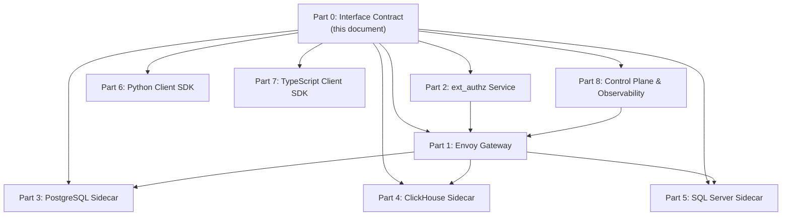

# Part 0: Shared Interface Contract

> **Status:** Canonical  
> **Consumers:** Envoy Gateway, ext_authz, all sidecars, Python SDK, TypeScript SDK, Control Plane  
> **Format:** Protocol Buffers v3

---

## 1. Proto Package Structure

```
proto/
├── gateway/v1/
│   ├── gateway_service.proto   # Main service definition
│   ├── common.proto            # Shared types, enums, error model
│   ├── auth.proto              # ext_authz ↔ Envoy contract
│   └── telemetry.proto         # ALS/observability message types
```

---

## 2. Core Service Definition

```protobuf
syntax = "proto3";
package gateway.v1;

import "google/protobuf/timestamp.proto";
import "gateway/v1/common.proto";

service DataGateway {
  // Unary: small result sets (<10K rows or known-bounded)
  rpc Query(QueryRequest) returns (QueryResponse);

  // Server-streaming: large/unbounded result sets
  rpc QueryStream(QueryRequest) returns (stream QueryChunk);

  // Health/readiness probe
  rpc HealthCheck(HealthCheckRequest) returns (HealthCheckResponse);
}
```

---

## 3. Request/Response Messages

```protobuf
// --- Requests ---

message QueryRequest {
  // Target database identifier. Envoy routes on this value.
  // Valid values: "pg", "clickhouse", "mssql"
  string target = 1;

  // Database name on the target server (e.g., "analytics", "warehouse")
  string database = 2;

  // Ready-to-execute SQL query. Must be a SELECT (sidecars enforce read-only).
  // Client library is responsible for parameterization before sending.
  string sql = 3;

  // Desired response serialization format
  OutputFormat format = 4;

  // Client-requested limits (sidecar enforces a ceiling per tier)
  QueryLimits limits = 5;

  // Client-generated trace ID for OTel distributed tracing.
  // If empty, the sidecar generates one.
  string trace_id = 6;

  // Optional: client-generated idempotency key for deduplication
  string idempotency_key = 7;
}

message HealthCheckRequest {}

// --- Responses ---

message QueryResponse {
  // Serialized result data (Arrow IPC / Parquet / JSON)
  bytes data = 1;
  ResponseMetadata metadata = 2;
}

message QueryChunk {
  // One Arrow RecordBatch (IPC) or Parquet row group or JSON fragment
  bytes data = 1;
  // True on the final chunk
  bool is_last = 2;
  // Populated ONLY on the final chunk (is_last=true)
  ResponseMetadata metadata = 3;
}

message HealthCheckResponse {
  ServiceStatus status = 1;
  map<string, ComponentHealth> components = 2;
}
```

---

## 4. Common Types

```protobuf
// --- Enums ---

enum OutputFormat {
  OUTPUT_FORMAT_UNSPECIFIED = 0;
  ARROW_IPC = 1;    // Default. Apache Arrow IPC streaming format.
  PARQUET = 2;      // Parquet with Snappy compression.
  JSON = 3;         // JSON lines. Hard-limited to max_rows=10000 by sidecar.
}

enum ServiceStatus {
  SERVICE_STATUS_UNSPECIFIED = 0;
  SERVING = 1;
  NOT_SERVING = 2;
  DEGRADED = 3;      // Partial functionality (e.g., one DB unreachable)
}

// --- Limit Types ---

message QueryLimits {
  // Max rows to return. 0 = use sidecar-tier default.
  // Sidecar enforces: min(client_request, tier_ceiling).
  int64 max_rows = 1;

  // Max response payload size in bytes. 0 = sidecar default.
  int64 max_bytes = 2;

  // Query execution timeout in seconds. 0 = sidecar default.
  int32 timeout_seconds = 3;
}

// --- Metadata ---
// Schema is NOT duplicated here — the Arrow IPC stream itself contains
// the schema header. Clients read schema from the Arrow stream directly.

message ResponseMetadata {
  // Number of rows returned. Sidecar counts rows as it streams.
  int64 rows_returned = 1;

  // Trace ID (from QueryRequest.trace_id or sidecar-generated).
  string query_id = 2;

  // True if result was truncated by max_rows or max_bytes ceiling.
  bool truncated = 3;

  // Wall-clock query execution time at the sidecar (ms).
  // Available on final chunk only.
  int64 execution_time_ms = 4;

  // Timestamp of when the sidecar began executing the query.
  google.protobuf.Timestamp timestamp = 5;
}

// --- Health ---

message ComponentHealth {
  ServiceStatus status = 1;
  string message = 2;         // Human-readable status detail
  int64 latency_ms = 3;       // Last health check latency
}
```

---

## 5. gRPC Metadata Contract

### 5.1 Client → Envoy (request metadata)

| Key | Source | Required | Description |
|---|---|---|---|
| `x-target-db` | Client SDK | ✅ | Must match `QueryRequest.target`. Envoy routes on this |
| `x-idempotency-key` | Client | ❌ | Optional deduplication key |

> [!IMPORTANT]
> **No API key.** Client identity is derived entirely from the mTLS client certificate SAN (SPIFFE URI or CN). The cert IS the credential.

### 5.2 Envoy → Sidecar (injected by ext_authz)

Proxy → sidecar connections are also mTLS-secured. ext_authz injects the following after validating the client cert:

| Key | Source | Description |
|---|---|---|
| `x-client-identity` | ext_authz | SPIFFE URI or SAN extracted from client cert (e.g., `spiffe://corp/user/matt`) |
| `x-rate-tier` | ext_authz | User's rate limit tier: `"standard"`, `"premium"` |
| `x-max-rows-ceiling` | ext_authz | Tier-enforced max rows ceiling |
| `x-max-timeout-ceiling` | ext_authz | Tier-enforced max timeout (seconds) |
| `x-trace-id` | ext_authz (from `QueryRequest.trace_id` or generated) | OTel distributed trace ID |

> [!IMPORTANT]
> **DB credentials are NOT injected by ext_authz.** The sidecar looks up the user's DB credentials from Vault using `x-client-identity`. Each DB connection is made AS the user, not via a shared service account. This preserves the database's native RBAC, row-level security, and audit trail.

### 5.3 Sidecar → Client (response metadata)

| Key | Description |
|---|---|
| `x-query-id` | Trace ID / query ID |
| `x-truncated` | `"true"` if result was truncated |

### 5.4 Headers stripped by Envoy before returning to client

```
x-client-identity, x-rate-tier,
x-max-rows-ceiling, x-max-timeout-ceiling
```

---

## 6. Error Model

All errors are returned as standard gRPC status codes with `google.rpc.Status` details:

| gRPC Code | When | Example `message` |
|---|---|---|
| `INVALID_ARGUMENT` (3) | Malformed SQL, unknown target | `"Unknown target 'oracle'. Valid: pg, clickhouse, mssql"` |
| `UNAUTHENTICATED` (16) | Invalid/expired mTLS cert | `"Client certificate not trusted or expired"` |
| `PERMISSION_DENIED` (7) | Identity lacks access to requested target/database | `"Identity 'spiffe://corp/user/matt' cannot access target 'mssql'"` |
| `RESOURCE_EXHAUSTED` (8) | Rate limit exceeded, connection pool full, circuit breaker open | `"Rate limit exceeded for identity. Retry after 30s"` |
| `DEADLINE_EXCEEDED` (4) | Query timeout hit | `"Query exceeded 60s timeout"` |
| `FAILED_PRECONDITION` (9) | Write query attempted on read-only gateway | `"Only SELECT statements are permitted"` |
| `UNAVAILABLE` (14) | Database backend unreachable, sidecar unhealthy | `"PostgreSQL cluster is unreachable"` |
| `INTERNAL` (13) | Unexpected sidecar/serialization error | `"Arrow serialization failed: ..."` |
| `CANCELLED` (1) | Client cancelled the stream | — |

**Error detail proto:**

```protobuf
message GatewayError {
  string error_code = 1;       // Machine-readable: "RATE_LIMIT_EXCEEDED"
  string message = 2;          // Human-readable detail
  string query_id = 3;         // Trace ID for correlation
  int32 retry_after_seconds = 4; // Hint for RESOURCE_EXHAUSTED
  string target = 5;           // Which DB target errored
}
```

---

## 7. Tier Limit Ceilings

| Parameter | Free | Standard | Premium |
|---|---|---|---|
| `max_rows` | 10,000 | 1,000,000 | 100,000,000 |
| `max_bytes` | 100 MB | 10 GB | 500 GB |
| `timeout_seconds` | 30 | 120 | 600 |
| `max_concurrent_queries` | 2 | 10 | 50 |
| `rate_limit` (req/min) | 60 | 600 | 6,000 |
| `json_format_allowed` | ❌ | ✅ (max 10K rows) | ✅ (max 10K rows) |

---

## 8. Component Dependency Graph



Each component document (Parts 1–8) references this contract and must conform to the message formats, metadata conventions, error codes, and tier limits defined here.

---

## 9. Error Classification & Retry Policy

### 9.1 Retryable vs Terminal Errors

| gRPC Code | Retryable? | SDK Behavior | Max Retries | Notes |
|---|---|---|---|---|
| `UNAVAILABLE` (14) | ✅ Yes | Exponential backoff + jitter | 3 | DB or sidecar temporarily down |
| `RESOURCE_EXHAUSTED` (8) | ✅ Yes | Wait `retry_after_seconds` from `GatewayError` | 2 | Rate limit — honor retry hint |
| `DEADLINE_EXCEEDED` (4) | ⚠️ Conditional | Retry ONLY if query is idempotent (SELECT) | 1 | May indicate long-running query — don't retry blindly |
| `INTERNAL` (13) | ⚠️ Conditional | Retry once if transient (serialization glitch) | 1 | If persistent, surface to user |
| `CANCELLED` (1) | ❌ No | — | 0 | Client-initiated — nothing to retry |
| `INVALID_ARGUMENT` (3) | ❌ No | Surface error immediately | 0 | Bad SQL, unknown target |
| `UNAUTHENTICATED` (16) | ❌ No | Surface error immediately | 0 | Cert issue — retrying won't help |
| `PERMISSION_DENIED` (7) | ❌ No | Surface error immediately | 0 | Identity lacks access |
| `FAILED_PRECONDITION` (9) | ❌ No | Surface error immediately | 0 | Write query on read-only gateway |

### 9.2 Retry Strategy

```
Attempt 1: immediate
Attempt 2: 100ms + jitter(0–50ms)
Attempt 3: 500ms + jitter(0–250ms)
Attempt 4: 2000ms + jitter(0–1000ms)  (if max_retries=4)
```

**Jitter formula:** `delay * (0.5 + random(0, 0.5))`

Both SDKs MUST implement this identically. Configuration:

```python
# Python SDK
client = GatewayClient(
    ...,
    retry=RetryPolicy(
        max_retries=3,
        retryable_codes=[UNAVAILABLE, RESOURCE_EXHAUSTED],
        initial_backoff_ms=100,
        max_backoff_ms=5000,
        backoff_multiplier=5.0,
    )
)
```

### 9.3 Circuit Breaker (Sidecar → DB)

Each sidecar maintains a per-DB circuit breaker:

| State | Condition | Behavior |
|---|---|---|
| **Closed** | < 5 failures in 60s window | Normal operation |
| **Open** | ≥ 5 consecutive failures OR ≥ 50% error rate in 60s | Reject immediately with `UNAVAILABLE`, no DB connection attempt |
| **Half-Open** | After 30s cooldown | Allow 1 probe query. Success → Closed. Failure → Open |

> [!IMPORTANT]
> Envoy also has outlier detection at the cluster level (Part 1). The sidecar circuit breaker is a defense-in-depth layer that prevents thundering herd on a failing DB.

### 9.4 Stream Reconnection

For `QueryStream`, if the gRPC stream breaks mid-transfer:

| Scenario | SDK Behavior |
|---|---|
| Connection reset before first chunk | Retry per retry policy |
| Connection reset after partial data | **Do NOT retry.** Surface error. Partial data is discarded. |
| Server sends error chunk mid-stream | Surface error. Discard partial data. No retry. |

**Rationale:** Resumable streams require server-side cursor state, which conflicts with the stateless sidecar model. A failed stream means re-executing the query from scratch, which could be expensive. Let the caller decide.

---

## 10. Performance Budget

### 10.1 End-to-End Latency Breakdown (P99 Target)

```
Total P99 target: ≤ 500ms (for 1K-row interactive queries)
                  ≤ 5s first-byte (for 1M-row bulk queries)

┌──────────────────────────────────────────────────────────────┐
│ Component              │ P99 Budget │ Notes                  │
├──────────────────────────────────────────────────────────────┤
│ SDK → Envoy (network)  │    5ms     │ Same-region            │
│ Envoy routing          │    2ms     │ xDS config lookup      │
│ ext_authz              │   10ms     │ L1 cache hit           │
│                        │   50ms     │ L3 Vault lookup        │
│ Envoy → Sidecar        │    2ms     │ Internal network       │
│ Vault cred lookup      │   30ms     │ Cached lease           │
│                        │  100ms     │ New lease issuance     │
│ DB query execution     │  400ms     │ Query-dependent        │
│ Serialization          │   20ms     │ PG/MSSQL Arrow encode  │
│                        │    0ms     │ CH passthrough         │
│ Sidecar → Envoy → SDK  │    5ms     │ First chunk            │
│ SDK ingest (Polars)    │   30ms     │ 1K rows to DataFrame   │
│ SDK ingest (DuckDB)    │   50ms     │ 1K rows to WASM table  │
├──────────────────────────────────────────────────────────────┤
│ TOTAL (interactive)    │ ~500ms     │ P99 with warm caches   │
│ TOTAL (cold auth)      │ ~650ms     │ P99 with Vault lookup  │
└──────────────────────────────────────────────────────────────┘
```

### 10.2 Throughput Targets

| Component | Metric | Target | Bottleneck Factor |
|---|---|---|---|
| **Envoy** | Requests/sec (total) | 10,000 rps | CPU (L7 filter chain) |
| **ext_authz** | Decisions/sec | 5,000 dps | Redis latency |
| **PG Sidecar** (per pod) | Queries/sec (1K rows) | 500 qps | asyncpg connection pool |
| **PG Sidecar** (per pod) | Data throughput | 500 MB/s | Arrow serialization CPU |
| **CH Sidecar** (per pod) | Data throughput | 2 GB/s | Network (passthrough) |
| **MSSQL Sidecar** (per pod) | Queries/sec (1K rows) | 200 qps | connectorx thread pool |
| **Vault** | Credential issuances/sec | 100 /s | Vault storage backend |
| **Redis (RLS)** | Rate limit checks/sec | 50,000 /s | Single-thread Redis |

### 10.3 Connection Limits & Cascade

```
Client connections to Envoy:     10,000 max (per Envoy pod)
  └─ Envoy → ext_authz:          1,000 max (gRPC connection pool)
  └─ Envoy → Sidecar:            2,000 max (per sidecar cluster)
      └─ Sidecar → DB:             64 max per user (connection pool)
      └─ Sidecar → Vault:          32 max (credential request pool)
      └─ Sidecar → Redis:         128 max (rate limit cache)
```

> [!WARNING]
> **Cascade failure risk:** If Vault becomes slow (>1s), sidecar connection pools fill up waiting for credentials. This triggers Envoy's circuit breaker, causing `UNAVAILABLE` for all users. The Vault credential cache (TTL-based) mitigates this — cached credentials bypass Vault entirely.

### 10.4 Memory Budgets

| Component | Memory Limit | Peak Scenario |
|---|---|---|
| Envoy | 1 GB | 10K concurrent connections with buffering |
| ext_authz | 512 MB | L1 cache with 10K identity entries |
| PG Sidecar | 2 GB | 10 concurrent 1M-row Arrow serializations |
| CH Sidecar | 512 MB | Passthrough — memory is proportional to chunk size (1MB) |
| MSSQL Sidecar | 2 GB | connectorx in-memory Arrow table construction |
| Python SDK (client) | — | Proportional to result size (Polars zero-copy) |
| TS SDK (browser) | ~2 GB | DuckDB-WASM + Arrow buffer ceiling |

---

## 11. API Versioning Policy

### 11.1 Proto Evolution Rules

The gateway uses **proto3 with additive-only evolution**:

| Change Type | Allowed? | Example |
|---|---|---|
| Add new field to existing message | ✅ Yes | Add `priority` field to `QueryRequest` |
| Add new enum value | ✅ Yes | Add `ARROW_FLIGHT` to `OutputFormat` |
| Add new RPC method | ✅ Yes | Add `QueryBatch()` RPC |
| Rename a field | ❌ No | Renaming breaks JSON serialization |
| Change field number | ❌ No | Breaks binary wire format |
| Remove a field | ⚠️ Deprecate only | Mark with `[deprecated = true]`, keep field number reserved |
| Change field type | ❌ No | Use a new field instead |
| Remove an enum value | ❌ No | Reserve the numeric value |
| Change RPC request/response type | ❌ No | Create a new RPC instead |

### 11.2 Backward Compatibility Guarantee

- **Wire format:** Clients compiled against `gateway.v1` proto MUST continue to work against any future `v1.x` server. New fields are ignored by old clients (proto3 default behavior).
- **Metadata headers:** New headers may be added. Existing headers will not be removed or have their semantics changed.
- **Error codes:** New error details may be added to `GatewayError`. No existing error code will change its meaning.
- **Breaking changes** require a new package: `gateway.v2`. Old and new packages are served simultaneously via Envoy routing on the proto package name.

### 11.3 Deprecation Process

```
1. Mark field/RPC as deprecated in proto with comment + [deprecated = true]
2. Log a warning in sidecars when deprecated fields are used
3. Announce deprecation in CHANGELOG with removal target (minimum 6 months)
4. After 6 months: reserve the field number, remove server-side handling
5. Never reuse a deprecated field number
```

### 11.4 Version Detection

```protobuf
// Clients can detect server capabilities via HealthCheck
message HealthCheckResponse {
  ServiceStatus status = 1;
  map<string, ComponentHealth> components = 2;
  string api_version = 3;         // e.g., "v1.3.0"
  repeated string capabilities = 4; // e.g., ["arrow_ipc", "parquet", "json", "batch"]
}
```

### 11.5 CI Enforcement

Proto compatibility is enforced in CI via `buf breaking`:

```bash
# In CI pipeline — blocks merge if breaking changes detected
buf breaking proto/ --against .git#branch=main
```

