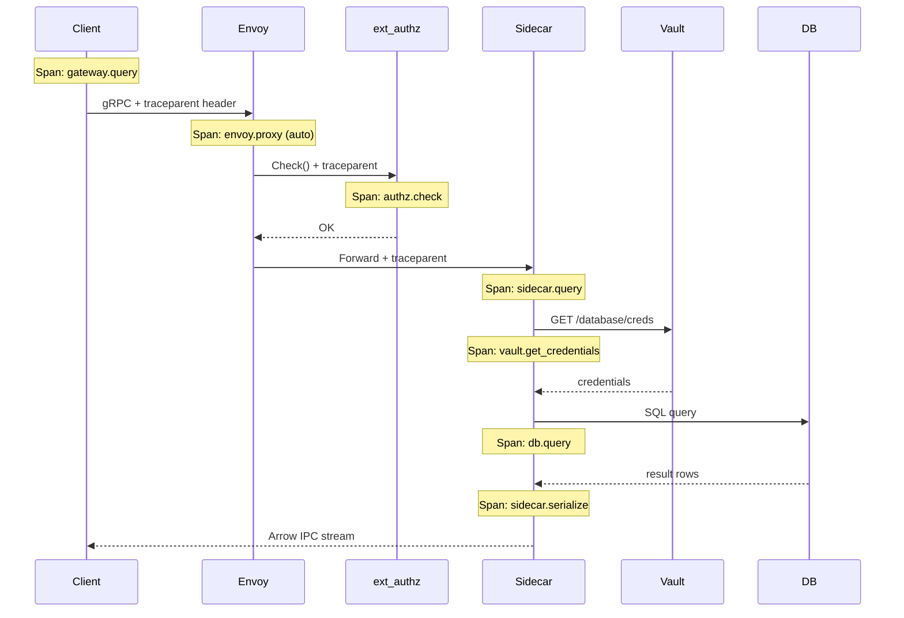

# Part 8: Control Plane & Observability — Design Document

> **Component:** Python services for xDS, ALS, Rate Limiting, Breakglass, and OTel Instrumentation  
> **Depends on:** [Part 0: Interface Contract](file:///Users/matt/.gemini/antigravity/brain/e9320286-501d-4c6b-b88e-eee0f36d38cc/part0_interface_contract.md), [Part 1: Envoy Gateway](file:///Users/matt/.gemini/antigravity/brain/e9320286-501d-4c6b-b88e-eee0f36d38cc/part1_envoy_gateway.md)  
> **Sub-components:** xDS Server, ALS Sink, Query Assassin, DB Cost Poller, RLS Backend, OTel Collector

---

## 1. Sub-Component Map

| Service | Purpose | Runs As |
|---|---|---|
| **xDS Server** | Dynamic Envoy config (LDS/CDS/RDS/EDS) | StatefulSet (2 replicas, leader election) |
| **ALS Sink** | Receive gRPC access logs from Envoy | Deployment (2 replicas) |
| **Query Assassin** | Kill orphaned DB queries on disconnect | Co-located with ALS Sink |
| **DB Cost Poller** | Poll `pg_stat_statements` / `system.query_log` | CronJob or Deployment (1 replica) |
| **RLS Backend** | Global rate limit decisions via Redis | Deployment (3 replicas) or use reference Go impl |
| **OTel Collector** | Receives traces/metrics from all components, exports to backends | DaemonSet or Deployment (2 replicas) |

---

## 2. OpenTelemetry Instrumentation

### 2.1 Distributed Trace Propagation

Every query carries a trace from client to database and back. The `trace_id` from `QueryRequest` is promoted to the W3C `traceparent` header for cross-component propagation.



### 2.2 Per-Component Instrumentation

| Component | OTel Integration | Spans Created | Auto-Instrumentation |
|---|---|---|---|
| **Python SDK** | `opentelemetry-api` | `gateway.query`, `gateway.query.stream` | gRPC client interceptor |
| **TypeScript SDK** | `@opentelemetry/api` | `gateway.query`, `duckdb.ingest` | Connect-ES interceptor |
| **BFF** | `@opentelemetry/sdk-node` | `bff.oidc.validate`, `bff.proxy.forward` | Express/Fastify auto |
| **Envoy** | Native tracing | `envoy.proxy` | Built-in, exports to OTel Collector |
| **ext_authz** | `opentelemetry-instrumentation-grpc` | `authz.check`, `authz.cache.lookup`, `authz.vault.lookup` | gRPC server interceptor |
| **PG Sidecar** | `opentelemetry-instrumentation-asyncpg` | `sidecar.query`, `sidecar.serialize`, `vault.get_credentials` | asyncpg auto + custom |
| **CH Sidecar** | `opentelemetry-instrumentation-httpx` | `sidecar.query`, `sidecar.stream` | httpx auto + custom |
| **MSSQL Sidecar** | Custom spans | `sidecar.query`, `sidecar.serialize`, `sidecar.driver_select` | Manual (no auto-instrumentation for connectorx) |
| **DB Cost Poller** | Custom spans | `cost_poller.poll_pg`, `cost_poller.poll_ch` | Manual |

### 2.3 Span Attributes (OTel Semantic Conventions)

All spans follow [OTel Database Semantic Conventions](https://opentelemetry.io/docs/specs/semconv/database/) and [RPC Semantic Conventions](https://opentelemetry.io/docs/specs/semconv/rpc/):

```python
# Sidecar span attributes (OTel semconv)
span.set_attributes({
    # RPC conventions
    "rpc.system": "grpc",
    "rpc.service": "gateway.v1.DataGateway",
    "rpc.method": "QueryStream",
    # DB conventions
    "db.system": "postgresql",         # or "clickhouse", "mssql"
    "db.name": request.database,
    "db.operation": "SELECT",
    "db.statement": request.sql[:1000],  # Truncate for safety
    # Gateway-specific
    "gateway.target": request.target,
    "gateway.identity": identity,
    "gateway.rate_tier": tier,
    "gateway.format": "ARROW_IPC",
    "gateway.trace_id": trace_id,
    # Result attributes (set on span end)
    "gateway.rows_returned": rows_returned,
    "gateway.bytes_sent": bytes_sent,
    "gateway.truncated": truncated,
    "gateway.execution_time_ms": exec_time,
    "gateway.driver": "asyncpg",       # or "connectorx", "turbodbc", "httpx"
})
```

### 2.4 Trace Context Propagation

```python
# Client SDK: inject trace context into gRPC metadata
from opentelemetry import trace, context
from opentelemetry.propagators import inject

tracer = trace.get_tracer("gateway.client")

async def query(self, sql: str, **kwargs) -> pl.DataFrame:
    with tracer.start_as_current_span("gateway.query") as span:
        span.set_attribute("db.statement", sql[:1000])
        metadata = [("x-target-db", target)]
        # Inject W3C traceparent into gRPC metadata
        inject(carrier=metadata, setter=GrpcMetadataSetter())
        async for chunk in self._stub.QueryStream(request, metadata=metadata):
            ...
```

```python
# Sidecar: extract trace context from incoming gRPC metadata
from opentelemetry.propagators import extract

async def QueryStream(self, request, context):
    md = dict(context.invocation_metadata())
    parent_ctx = extract(carrier=md, getter=GrpcMetadataGetter())
    with tracer.start_as_current_span("sidecar.query", context=parent_ctx) as span:
        ...
```

---

## 3. OTel Metrics Catalog

### 3.1 Gateway Throughput (Envoy + ALS Sink)

| Metric Name | Type | Unit | Labels | Purpose |
|---|---|---|---|---|
| `gateway.request.count` | Counter | `{requests}` | `target`, `method`, `status` | Total query volume |
| `gateway.request.duration` | Histogram | `ms` | `target`, `method`, `status` | End-to-end latency (P50/P95/P99) |
| `gateway.request.active` | UpDownCounter | `{requests}` | `target` | Concurrent in-flight queries |
| `gateway.data.sent` | Counter | `By` | `target`, `format`, `identity_hash` | Bytes returned to clients |
| `gateway.data.received` | Counter | `By` | `target` | Bytes received from clients |
| `gateway.connection.count` | UpDownCounter | `{connections}` | — | Active client connections |

### 3.2 Sidecar Performance

| Metric Name | Type | Unit | Labels | Purpose |
|---|---|---|---|---|
| `sidecar.query.duration` | Histogram | `ms` | `target`, `driver`, `outcome` | DB query execution time |
| `sidecar.serialize.duration` | Histogram | `ms` | `target`, `format` | Arrow/Parquet serialization time |
| `sidecar.rows.returned` | Counter | `{rows}` | `target` | Total rows served |
| `sidecar.query.truncated` | Counter | `{queries}` | `target`, `reason` | Queries hit max_rows/max_bytes |
| `sidecar.pool.active` | UpDownCounter | `{connections}` | `target`, `identity_hash` | Per-user connection pool usage |
| `sidecar.pool.max` | Gauge | `{connections}` | `target` | Connection pool ceiling |
| `sidecar.driver.fallback` | Counter | `{fallbacks}` | `from_driver`, `to_driver` | MSSQL tier fallback events |

### 3.3 Auth & Identity

| Metric Name | Type | Unit | Labels | Purpose |
|---|---|---|---|---|
| `authz.decision.count` | Counter | `{decisions}` | `result` (allow/deny), `reason` | Auth decision volume |
| `authz.decision.duration` | Histogram | `ms` | `cache_layer` (L1/L2/L3) | Auth decision latency |
| `authz.cache.hit_ratio` | Gauge | `1` | `layer` | Cache effectiveness |
| `vault.credential.issue.count` | Counter | `{issuances}` | `target`, `tier` | Dynamic credential issuances |
| `vault.credential.issue.duration` | Histogram | `ms` | `target` | Vault credential retrieval time |
| `vault.credential.renewal.count` | Counter | `{renewals}` | `target`, `outcome` | Lease renewals (success/fail) |
| `vault.auth.duration` | Histogram | `ms` | — | SPIFFE auth to Vault latency |

### 3.4 DB Backend Health

| Metric Name | Type | Unit | Labels | Purpose |
|---|---|---|---|---|
| `db.query.duration` | Histogram | `ms` | `db.system`, `identity_hash` | Server-side query execution |
| `db.query.killed` | Counter | `{queries}` | `db.system`, `reason` | Queries terminated by assassin |
| `db.cost.tokens_deducted` | Counter | `{tokens}` | `db.system`, `identity_hash` | Resource cost attribution |
| `db.cost.cpu_ms` | Counter | `ms` | `db.system`, `identity_hash` | CPU time per identity |
| `db.cost.bytes_read` | Counter | `By` | `db.system`, `identity_hash` | I/O volume per identity |
| `db.cost.memory_bytes` | Counter | `By` | `db.system`, `identity_hash` | Peak memory per query |

### 3.5 Platform KPIs

| Metric Name | Type | Unit | Labels | Purpose |
|---|---|---|---|---|
| `gateway.unique_identities.active` | Gauge | `{identities}` | — | Unique users in last 5 min |
| `gateway.error_budget.remaining` | Gauge | `1` | — | SLO error budget (1.0 = 100%) |
| `gateway.availability` | Gauge | `1` | — | Rolling 5-min success rate |
| `rls.rate_limit.triggered` | Counter | `{triggers}` | `identity_hash`, `target` | Rate limit enforcement events |

---

## 4. xDS Control Plane

### Purpose
Push dynamic configuration to Envoy without restarts: add/remove sidecar endpoints, update routes, apply RBAC kill-switches.

### Implementation

```python
class XdsControlPlane:
    """Python gRPC xDS server using envoy_data_plane protobufs."""

    def __init__(self, config_store: ConfigStore):
        self._store = config_store  # Reads desired state from DB/file
        self._snapshot_cache: dict[str, Snapshot] = {}
        self._version = 0

    async def StreamAggregatedResources(self, request_iterator, context):
        """ADS: single gRPC stream carrying LDS, CDS, RDS, EDS."""
        node_id = None
        async for request in request_iterator:
            node_id = node_id or request.node.id
            snapshot = self._snapshot_cache.get(node_id, self._build_snapshot())
            response = self._build_response(request.type_url, snapshot)
            yield response

    def _build_snapshot(self) -> Snapshot:
        """Build current desired state from config store."""
        return Snapshot(
            listeners=self._build_listeners(),
            clusters=self._build_clusters(),
            routes=self._build_routes(),
            endpoints=self._build_endpoints(),
            version=str(self._version),
        )
```

### Kill-Switch via xDS

```python
async def blackhole_identity(self, identity: str, reason: str) -> None:
    """Push RBAC deny rule to all Envoy instances within ~50ms."""
    self._version += 1
    self._rbac_deny_list.add(identity)
    snapshot = self._build_snapshot()
    for node_id in self._snapshot_cache:
        self._snapshot_cache[node_id] = snapshot
    logger.critical(f"BLACKHOLE: identity={identity} reason={reason}")
```

---

## 5. ALS Sink + Query Assassin

### ALS Sink

Receives streaming access logs from Envoy via gRPC. Emits OTel metrics for every request:

```python
class ALSSink(AccessLogServiceServicer):
    def __init__(self):
        meter = metrics.get_meter("gateway.als")
        self._request_counter = meter.create_counter(
            "gateway.request.count", unit="{requests}")
        self._request_duration = meter.create_histogram(
            "gateway.request.duration", unit="ms")
        self._data_sent = meter.create_counter(
            "gateway.data.sent", unit="By")

    async def _process_entry(self, entry: HTTPAccessLogEntry):
        identity = self._get_header(entry.request, "x-client-identity")
        trace_id = self._get_header(entry.request, "x-request-id")
        target_db = self._get_header(entry.request, "x-target-db")
        duration_ms = entry.common_properties.duration.ToMilliseconds()
        status = entry.response.response_code.value

        labels = {"target": target_db, "method": "QueryStream",
                  "status": str(status)}
        self._request_counter.add(1, labels)
        self._request_duration.record(duration_ms, labels)
        self._data_sent.add(entry.response.response_body_bytes,
                           {"target": target_db, "format": "arrow_ipc",
                            "identity_hash": _hash(identity)})

        # Persist for chargeback/audit
        await self._telemetry_store.record(
            identity=identity, trace_id=trace_id, target=target_db,
            bytes_in=entry.request.request_body_bytes,
            bytes_out=entry.response.response_body_bytes,
            duration_ms=duration_ms, status=status)

        # Trigger Query Assassin on abnormal termination
        term = entry.common_properties.connection_termination_details
        if term in ("proxy_timeout", "downstream_reset"):
            await self._query_assassin.kill(trace_id, target_db)
```

### Query Assassin

```python
class QueryAssassin:
    def __init__(self, pg_admin_pool, ch_client, mssql_admin_pool):
        self._pg = pg_admin_pool
        self._ch = ch_client
        self._mssql = mssql_admin_pool
        meter = metrics.get_meter("gateway.assassin")
        self._kill_counter = meter.create_counter(
            "db.query.killed", unit="{queries}")

    async def kill(self, trace_id: str, target: str) -> None:
        with tracer.start_as_current_span("assassin.kill",
                attributes={"gateway.trace_id": trace_id, "target": target}):
            if target == "pg":
                pid = await self._pg.fetchval(
                    "SELECT pid FROM pg_stat_activity "
                    "WHERE query LIKE $1 AND state='active'",
                    f"%trace_id={trace_id}%")
                if pid:
                    await self._pg.execute("SELECT pg_terminate_backend($1)", pid)
                    self._kill_counter.add(1, {"db.system": "postgresql",
                                               "reason": "client_disconnect"})

            elif target == "clickhouse":
                await self._ch.execute(
                    f"KILL QUERY WHERE query LIKE '%trace_id={trace_id}%' SYNC")
                self._kill_counter.add(1, {"db.system": "clickhouse",
                                           "reason": "client_disconnect"})

            elif target == "mssql":
                async with self._mssql.acquire() as conn:
                    result = await conn.execute(
                        "SELECT r.session_id FROM sys.dm_exec_requests r "
                        "CROSS APPLY sys.dm_exec_sql_text(r.sql_handle) t "
                        f"WHERE t.text LIKE '%trace_id={trace_id}%'")
                    for row in result:
                        await conn.execute(f"KILL {row[0]}")
                    self._kill_counter.add(1, {"db.system": "mssql",
                                               "reason": "client_disconnect"})
```

---

## 6. DB Cost Poller — Resource-Based Rate Limiting

```
┌──────────────┐    poll    ┌────────────────┐    deduct    ┌───────┐
│  PostgreSQL  │◀───────────│  DB Cost Poller│────────────▶│ Redis │
│  pg_stat_*   │            │  (every 5s)    │             │ (RLS) │
├──────────────┤            │                │             │       │
│  ClickHouse  │◀───────────│  Calculates    │ ──emit──▶  OTel    │
│  system.*    │            │  cost tokens   │            Metrics  │
└──────────────┘            └────────────────┘             └───────┘
```

```python
class DBCostPoller:
    """Polls database telemetry, deducts cost tokens from RLS buckets."""

    def __init__(self):
        meter = metrics.get_meter("gateway.cost_poller")
        self._tokens_deducted = meter.create_counter(
            "db.cost.tokens_deducted", unit="{tokens}")
        self._cpu_counter = meter.create_counter(
            "db.cost.cpu_ms", unit="ms")
        self._bytes_read_counter = meter.create_counter(
            "db.cost.bytes_read", unit="By")
        self._memory_counter = meter.create_counter(
            "db.cost.memory_bytes", unit="By")

    async def poll_loop(self) -> None:
        while True:
            await asyncio.gather(
                self._poll_postgres(),
                self._poll_clickhouse(),
            )
            await asyncio.sleep(5)

    async def _poll_postgres(self) -> None:
        rows = await self._pg_pool.fetch("""
            SELECT
                (regexp_match(query, '/\\* .*identity=(\\S+)'))[1] AS identity,
                total_exec_time, shared_blks_read + shared_blks_hit AS blocks
            FROM pg_stat_statements
            WHERE query LIKE '%identity=%'
            AND total_exec_time > 1000
        """)
        for row in rows:
            cost = int(row["total_exec_time"] / 100)
            identity_hash = hashlib.sha256(row["identity"].encode()).hexdigest()
            labels = {"db.system": "postgresql", "identity_hash": identity_hash}
            self._tokens_deducted.add(cost, labels)
            self._cpu_counter.add(int(row["total_exec_time"]), labels)
            await self._redis.decrby(
                f"ratelimit:gateway:identity:{identity_hash}:tokens", cost)

    async def _poll_clickhouse(self) -> None:
        """Poll system.query_log for fine-grained resource consumption."""
        result = await self._ch.execute("""
            SELECT
                extractAll(log_comment, 'identity=(\\S+)')[1] AS identity,
                query_duration_ms,
                read_rows,
                read_bytes,
                written_bytes,
                result_rows,
                memory_usage,
                ProfileEvents['OSCPUVirtualTimeMicroseconds'] AS cpu_us,
                ProfileEvents['ReadCompressedBytes'] AS compressed_read,
                ProfileEvents['RealTimeMicroseconds'] AS wall_us,
                ProfileEvents['NetworkSendBytes'] AS net_send,
                ProfileEvents['NetworkReceiveBytes'] AS net_recv,
                ProfileEvents['DiskReadElapsedMicroseconds'] AS disk_read_us,
                ProfileEvents['SelectedParts'] AS parts_selected,
                ProfileEvents['SelectedMarks'] AS marks_selected
            FROM system.query_log
            WHERE event_time > now() - INTERVAL 10 SECOND
            AND type = 'QueryFinish'
            AND log_comment LIKE '%identity=%'
        """)
        for row in result:
            identity_hash = hashlib.sha256(row["identity"].encode()).hexdigest()
            labels = {"db.system": "clickhouse", "identity_hash": identity_hash}

            # Weighted cost formula:
            #   1 token per 100ms CPU + 1 token per GB read + 1 token per 100MB memory
            cpu_ms = row["cpu_us"] / 1000
            cost = (int(cpu_ms / 100)
                    + int(row["read_bytes"] / (1024**3))
                    + int(row["memory_usage"] / (100 * 1024**2)))

            # Emit OTel metrics for observability dashboards
            self._tokens_deducted.add(max(cost, 1), labels)
            self._cpu_counter.add(int(cpu_ms), labels)
            self._bytes_read_counter.add(row["read_bytes"], labels)
            self._memory_counter.add(row["memory_usage"], labels)

            await self._redis.decrby(
                f"ratelimit:gateway:identity:{identity_hash}:tokens",
                max(cost, 1))
```

### ClickHouse `system.query_log` Fields Used

| Field | What It Measures | Why It Matters at Scale |
|---|---|---|
| `query_duration_ms` | Wall-clock execution time | User-facing latency |
| `read_rows` | Rows scanned by query engine | Correlates with CPU cost |
| `read_bytes` | Bytes scanned from storage | I/O pressure on cluster |
| `written_bytes` | Bytes written (merges, projections) | Background load impact |
| `result_rows` | Rows returned to client | Network/serialization cost |
| `memory_usage` | Peak memory for query | OOM risk at scale |
| `ProfileEvents.OSCPUVirtualTimeMicroseconds` | Actual CPU time consumed | True compute cost |
| `ProfileEvents.ReadCompressedBytes` | Compressed data read from disk | Disk I/O pressure |
| `ProfileEvents.DiskReadElapsedMicroseconds` | Time spent on disk reads | Storage bottleneck indicator |
| `ProfileEvents.SelectedParts` | Data parts touched | Partition pruning effectiveness |
| `ProfileEvents.SelectedMarks` | Index marks scanned | Index utilization |
| `ProfileEvents.NetworkSendBytes` | Bytes sent over network | Egress cost |

---

## 7. Breakglass Operations Summary

| Operation | Method | Latency |
|---|---|---|
| **Block identity** | xDS RBAC push | ~50ms to all Envoys |
| **Kill user's queries** | Query Assassin via ALS | ~5s (poll interval) |
| **Manual kill** | `curl` to xDS API or direct DB `KILL` | Immediate |
| **Drain Envoy instance** | `POST /drain_listeners` on admin | Immediate |
| **Eject DB node** | Envoy outlier detection (auto) or admin | 5–30s (auto) |
| **Fail all health checks** | `POST /healthcheck/fail` on admin | Immediate |

### SRE Runbook Commands

```bash
# Block an identity
curl -X POST http://xds:8080/api/v1/blackhole \
  -d '{"identity":"spiffe://corp/user/matt","reason":"cluster_overload","ttl":3600}'

# Kill all PG queries from an identity
psql -h pg-primary -c "SELECT pg_terminate_backend(pid)
  FROM pg_stat_activity WHERE query LIKE '%identity=spiffe://corp/user/matt%'"

# Kill all CH queries from an identity
clickhouse-client --query \
  "KILL QUERY WHERE query LIKE '%identity=spiffe://corp/user/matt%' SYNC"

# Eject a DB node from Envoy pool
curl -X POST "http://envoy-admin:9901/clusters/sidecar_pg/hosts" \
  -d '{"address":"sidecar-pg-2:50051","health_status":"UNHEALTHY"}'
```

---

## 8. OTel Collector Pipeline

```
┌─────────────┐  ┌──────────────┐  ┌──────────────┐
│ Python SDKs │  │ Envoy Native │  │ TS SDK /     │
│ (OTLP gRPC) │  │ (OTLP gRPC)  │  │ BFF (OTLP)   │
└──────┬──────┘  └──────┬───────┘  └──────┬───────┘
       │                │                  │
       ▼                ▼                  ▼
    ┌──────────────────────────────────────────┐
    │       OTel Collector (DaemonSet)          │
    │                                           │
    │  Receivers: otlp (gRPC + HTTP)            │
    │  Processors:                              │
    │   - batch (200ms window)                  │
    │   - memory_limiter (80% pod memory)       │
    │   - attributes/resource                   │
    │   - tail_sampling (keep errors + slow)    │
    │  Exporters:                               │
    │   - Traces  → Jaeger / Tempo / GCP Trace  │
    │   - Metrics → Prometheus / Cortex / GCP   │
    │   - Logs    → Loki / CloudLogging         │
    └──────────────────────────────────────────┘
```

---

## 9. Deployment

| Service | Replicas | CPU | Memory | Notes |
|---|---|---|---|---|
| xDS Server | 2 (leader-elected) | 0.5 vCPU | 256 MB | StatefulSet |
| ALS Sink + Query Assassin | 2 | 1 vCPU | 512 MB | Stateless |
| DB Cost Poller | 1 | 0.5 vCPU | 256 MB | Single writer to avoid Redis conflicts |
| RLS Backend | 3 (or use Go ref impl) | 1 vCPU | 512 MB | Backed by Redis cluster |
| Redis (RLS/Auth cache) | 3-node cluster | 1 vCPU | 2 GB | Sentinel or Cluster mode |
| OTel Collector | DaemonSet (1 per node) | 0.5 vCPU | 512 MB | Or 2-replica Deployment |
