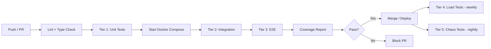

# Part 9: Testing Strategy — Design Document

> **Component:** Cross-cutting test architecture for all gateway components  
> **Depends on:** [Part 0: Interface Contract](file:///Users/matt/.gemini/antigravity/brain/e9320286-501d-4c6b-b88e-eee0f36d38cc/part0_interface_contract.md), all Parts 1–8  
> **Goal:** A developer can run the full test suite locally. CI gates on all tiers.

---

## 1. Test Tiers

```
┌─────────────────────────────────────────────────────┐
│  Tier 5: Chaos / Resilience          (nightly)      │
│  Tier 4: Load / Performance          (weekly + PR)   │
│  Tier 3: End-to-End                  (every PR)      │
│  Tier 2: Integration / Contract      (every PR)      │
│  Tier 1: Unit                        (every commit)  │
└─────────────────────────────────────────────────────┘
```

| Tier | Scope | Speed | CI Gate? | Infra Needed |
|---|---|---|---|---|
| **1 — Unit** | Single function/class | <5 min total | ✅ Every commit | None |
| **2 — Integration** | Component + real DB | <10 min | ✅ Every PR | Docker Compose |
| **3 — E2E** | Full path: SDK → Envoy → sidecar → DB | <15 min | ✅ Every PR | Docker Compose |
| **4 — Load** | Throughput / latency under sustained load | 30–60 min | ✅ Weekly, opt-in on PR | k8s or heavy Docker |
| **5 — Chaos** | Failure injection | 30 min | ⚠️ Nightly | k8s + Litmus/Toxiproxy |

---

## 2. Tier 1 — Unit Tests

### Per-Component Coverage

| Component | Unit Test Focus | Framework | Mock Boundaries |
|---|---|---|---|
| **Proto** | Message serialization roundtrip, enum coverage | `pytest` + `grpcio-testing` | — |
| **ext_authz** | XFCC header parsing, SPIFFE validation, tier lookup, cache | `pytest` | Redis (fakeredis), Vault (mock) |
| **PG Sidecar** | Pool management, Arrow serialization, query limits enforcement | `pytest` | asyncpg (mock), Vault (mock) |
| **CH Sidecar** | HTTP request construction, header injection, passthrough chunking | `pytest` | httpx (respx mock) |
| **MSSQL Sidecar** | Driver tier selection (connectorx → turbodbc → pyodbc), fallback | `pytest` | connectorx/turbodbc (mock) |
| **Python SDK** | Client construction, metadata injection, Polars DataFrame creation | `pytest` | gRPC (in-process mock server) |
| **TypeScript SDK** | Client options validation, DuckDB table creation, BFF transport | `vitest` | Connect-ES mock, DuckDB-WASM mock |
| **Control Plane** | xDS snapshot building, ALS entry processing, cost formula | `pytest` | Redis (fakeredis) |

### Naming Convention

```
test_<component>_<method>_<scenario>_<expected>.py
```

Example: `test_ext_authz_validate_cert_expired_cert_returns_unauthenticated.py`

---

## 3. Tier 2 — Integration Tests

### Local Test Infrastructure

```yaml
# docker-compose.test.yml
services:
  postgres:
    image: postgres:16
    ports: ["15432:5432"]
    environment:
      POSTGRES_DB: test_analytics
      POSTGRES_USER: test_user
      POSTGRES_PASSWORD: test_pass

  clickhouse:
    image: clickhouse/clickhouse-server:24
    ports: ["18123:8123", "19000:9000"]
    volumes:
      - ./testdata/ch_init.sql:/docker-entrypoint-initdb.d/init.sql

  mssql:
    image: mcr.microsoft.com/mssql/server:2022-latest
    ports: ["11433:1433"]
    environment:
      ACCEPT_EULA: "Y"
      SA_PASSWORD: "TestPass123!"

  redis:
    image: redis:7-alpine
    ports: ["16379:6379"]

  vault:
    image: hashicorp/vault:1.15
    ports: ["18200:8200"]
    environment:
      VAULT_DEV_ROOT_TOKEN_ID: "test-root-token"
    cap_add: [IPC_LOCK]
```

### Integration Test Scenarios

| Test | What It Validates | DBs Needed |
|---|---|---|
| PG sidecar → real PG | Query execution, Arrow serialization, row counts | PG |
| CH sidecar → real CH | ArrowStream passthrough, header injection | CH |
| MSSQL sidecar → real MSSQL | Driver fallback chain, truncation behavior | MSSQL |
| ext_authz → Redis | Cache layers (L1/L2/L3), tier resolution | Redis |
| Sidecar → Vault | SPIFFE auth, dynamic credential issuance, lease renewal | Vault |
| Cost poller → real DB | system.query_log parsing, pg_stat_statements parsing | PG + CH |

### Contract Tests

| Contract | Validated By |
|---|---|
| Proto backward compat | `buf breaking --against .git#branch=main` |
| SDK → sidecar metadata | Assert all required headers are present in mock server |
| Sidecar → Envoy response | Assert stripped headers are not present in client response |
| Error codes | Assert each gRPC code maps to the expected scenario |

---

## 4. Tier 3 — End-to-End Tests

### E2E Stack (Docker Compose)

Extends the integration stack with Envoy, ext_authz, and a sidecar:

```
┌──────────────┐     ┌──────────┐     ┌───────────┐     ┌──────┐
│ Test Client   │────▶│  Envoy   │────▶│  Sidecar  │────▶│  DB  │
│ (Python SDK)  │     │ (+ ext_  │     │  (PG/CH/  │     │      │
│               │◀────│  authz)  │◀────│  MSSQL)   │◀────│      │
└──────────────┘     └──────────┘     └───────────┘     └──────┘
        │                  │                │
        └──────────────────┴────────────────┘
              Self-signed mTLS certs (generated by test setup)
```

### E2E Test Cases

| Test | Flow | Validates |
|---|---|---|
| **Happy path — PG** | SDK → query `SELECT * FROM test_table LIMIT 100` → verify DataFrame | Full path, Arrow roundtrip |
| **Happy path — CH** | SDK → query `SELECT * FROM system.numbers LIMIT 1000` → verify parquet | CH passthrough, format negotiation |
| **Auth denied** | SDK with untrusted cert → expect `UNAUTHENTICATED` | mTLS enforcement |
| **Rate limit** | Send 100 queries rapidly → expect `RESOURCE_EXHAUSTED` after ceiling | RLS integration |
| **Timeout** | SDK → `SELECT sleep(120)` with 5s timeout → expect `DEADLINE_EXCEEDED` | Timeout propagation |
| **Truncation** | SDK → query returning 1M rows with max_rows=1000 → verify `truncated=true` | Limit enforcement |
| **Stream cancel** | SDK → start stream, cancel after 10 chunks → verify query killed on DB | Query assassin |
| **Vault creds** | SDK → query → sidecar fetches creds from Vault → verify DB connection as user | Dynamic credential flow |

### mTLS Certificate Generation for Tests

```bash
#!/bin/bash
# scripts/gen-test-certs.sh
# Generates self-signed CA + server/client certs for local testing

CERT_DIR="./testdata/certs"
mkdir -p "$CERT_DIR"

# CA
openssl req -x509 -newkey ec -pkeyopt ec_paramgen_curve:P-256 \
  -days 365 -nodes -keyout "$CERT_DIR/ca.key" -out "$CERT_DIR/ca.crt" \
  -subj "/CN=Test Gateway CA"

# Server cert (for Envoy)
openssl req -newkey ec -pkeyopt ec_paramgen_curve:P-256 -nodes \
  -keyout "$CERT_DIR/server.key" -out "$CERT_DIR/server.csr" \
  -subj "/CN=gateway.test" \
  -addext "subjectAltName=DNS:gateway.test,DNS:localhost,URI:spiffe://test/svc/envoy"
openssl x509 -req -in "$CERT_DIR/server.csr" -CA "$CERT_DIR/ca.crt" \
  -CAkey "$CERT_DIR/ca.key" -CAcreateserial -out "$CERT_DIR/server.crt" -days 365 \
  -extfile <(echo "subjectAltName=DNS:gateway.test,DNS:localhost,URI:spiffe://test/svc/envoy")

# Client cert (for SDK tests)
openssl req -newkey ec -pkeyopt ec_paramgen_curve:P-256 -nodes \
  -keyout "$CERT_DIR/client.key" -out "$CERT_DIR/client.csr" \
  -subj "/CN=test-user" \
  -addext "subjectAltName=URI:spiffe://test/user/test-user"
openssl x509 -req -in "$CERT_DIR/client.csr" -CA "$CERT_DIR/ca.crt" \
  -CAkey "$CERT_DIR/ca.key" -CAcreateserial -out "$CERT_DIR/client.crt" -days 365 \
  -extfile <(echo "subjectAltName=URI:spiffe://test/user/test-user")
```

---

## 5. Tier 4 — Load & Performance Tests

### Tool: `ghz` (gRPC benchmarking) + custom Python harness

### Per-Component Targets

| Component | Metric | Target | How to Test |
|---|---|---|---|
| **Envoy** | P99 proxy latency overhead | < 5ms | `ghz` through Envoy vs direct to sidecar |
| **ext_authz** | P99 auth decision | < 10ms (cache hit), < 50ms (Vault lookup) | `ghz` against ext_authz service |
| **PG Sidecar** | Throughput (1K-row queries) | > 500 qps | `ghz` with concurrent workers |
| **PG Sidecar** | Throughput (1M-row queries) | > 50 qps | Custom harness, measure MB/s |
| **CH Sidecar** | Passthrough throughput | > 2 GB/s | Custom harness, large ArrowStream |
| **MSSQL Sidecar** | Throughput (connectorx tier) | > 200 qps (1K rows) | `ghz` with concurrent workers |
| **Python SDK** | Client overhead (Polars ingest) | < 50ms for 1M rows | Benchmark harness |
| **TS SDK** | Client overhead (DuckDB ingest) | < 200ms for 1M rows | Vitest benchmark |
| **Vault** | Credential issuance | P99 < 100ms | Custom harness, concurrent identities |

### Load Test Profiles

| Profile | Concurrency | Duration | Query Mix |
|---|---|---|---|
| **Steady state** | 50 concurrent | 30 min | 70% small (1K rows), 20% medium (100K), 10% large (1M) |
| **Spike** | 0 → 200 in 10s | 5 min | 100% small queries |
| **Soak** | 20 concurrent | 4 hours | Mixed, with 1% error injection |
| **Single-user heavy** | 1 user, sequential | 30 min | 100% large (1M+ rows) — tests per-user pool limits |

---

## 6. Tier 5 — Chaos & Resilience Tests

### Tool: Toxiproxy (Docker) or Litmus (k8s)

| Scenario | Injection | Expected Behavior |
|---|---|---|
| **Vault unavailable** | Block port 8200 | Sidecar returns `UNAVAILABLE`, cached leases continue working until TTL |
| **DB failover** | Kill PG primary | Envoy outlier detection ejects, queries route to replica within 30s |
| **Sidecar crash mid-stream** | SIGKILL sidecar at 50% stream | Client SDK receives gRPC error, retries (if retryable) |
| **Redis down** | Block port 6379 | Rate limiting degrades to local fallback, ext_authz uses L1 cache |
| **Network partition** | 50% packet loss between Envoy↔sidecar | Queries timeout, circuit breaker opens after threshold |
| **Cert expiry** | Set cert `not_after` to past | `UNAUTHENTICATED`, alert fires on `tls.client.not_after` |
| **Vault lease expiry** | Set TTL to 5s, don't renew | Connection fails, sidecar requests new credentials |
| **Memory pressure** | Limit sidecar to 256MB, query 1M rows | `RESOURCE_EXHAUSTED` or OOM-kill → Envoy retries on healthy replica |

---

## 7. Test Data

### Seeding Strategy

| Database | Table | Rows | Purpose |
|---|---|---|---|
| **PG** | `test_analytics.events` | 10M | Realistic analytical query loads |
| **PG** | `test_analytics.users` | 100K | JOIN scenarios |
| **CH** | `test.hits` | 100M | Large scan queries, partition pruning |
| **CH** | `test.numbers` | — | `system.numbers` (built-in, infinite) |
| **MSSQL** | `test_dbo.transactions` | 5M | MSSQL-specific query patterns |

```bash
# Seed script (runs after docker-compose up)
scripts/seed-test-data.sh
```

---

## 8. CI/CD Pipeline



### CI Requirements

| Step | Tool | Timeout | Artifacts |
|---|---|---|---|
| Lint | `ruff`, `buf lint` | 1 min | — |
| Proto compat | `buf breaking` | 1 min | — |
| Unit tests | `pytest`, `vitest` | 5 min | Coverage XML |
| Docker Compose up | `docker compose` | 3 min | — |
| Integration tests | `pytest -m integration` | 10 min | — |
| E2E tests | `pytest -m e2e` | 15 min | — |
| Coverage gate | `coverage report` | 1 min | HTML report |

**Coverage target:** 90%+ per component (excluding generated proto stubs).

---

## 9. Test Ownership

| Component | Owner | Test Location |
|---|---|---|
| Proto / interface contract | Platform team | `proto/tests/` |
| Envoy config | Platform team | `envoy/tests/` (config validation) |
| ext_authz | Auth team | `ext_authz/tests/` |
| PG Sidecar | DB team | `sidecars/pg/tests/` |
| CH Sidecar | DB team | `sidecars/ch/tests/` |
| MSSQL Sidecar | DB team | `sidecars/mssql/tests/` |
| Python SDK | SDK team | `sdk/python/tests/` |
| TypeScript SDK | SDK team | `sdk/typescript/tests/` |
| Control Plane | Platform team | `control_plane/tests/` |
| E2E | Platform team | `tests/e2e/` |
| Load | SRE team | `tests/load/` |
